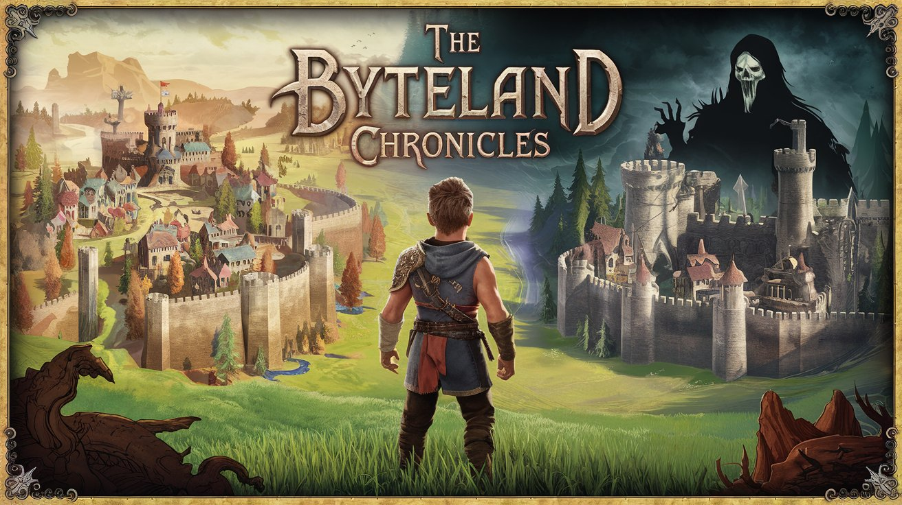

# The Byteland Chronicles

## Game Story

In the digital world of **Byteland**, a parallel universe made of codes, bytes,
and data, peace has been maintained for centuries thanks to the balance between two
fundamental powers: the **Kingdom of Code** and the **Kingdom of Data**. These two
kingdoms have lived in harmony, each playing a crucial role in maintaining the
stability and order of Byteland.

However, a dark threat emerges from the forgotten depths of cyberspace. An evil force
known as **The Corruptor** has begun to spread, corrupting data, sabotaging code,
and undermining the logic that holds Byteland together. No one knows where exactly
it comes from, but its power is growing rapidly, and the three kingdoms, who once
trusted each other, are now suspicious and isolated.

**Eddie**, a young apprentice programmer from the Kingdom of Code, witnesses the
destruction that The Corruptor is wreaking on his world. He realizes that the only
way to stop this threat is to unite the three kingdoms into an alliance, using
each kingdom's unique strengths to fight The Corruptor.

But the task is no easy one. Each kingdom is wary of the others, fearing that an
alliance could be used as a pretext for an invasion. Eddie must therefore embark
on an epic journey across Byteland, convincing the kingdoms' leaders to join
forces and showing that only by working together can they save their world.
